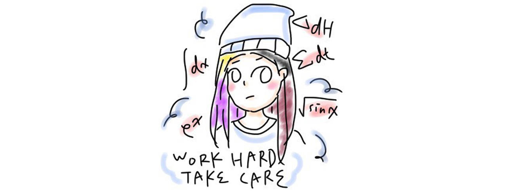

# pbb.wtf

<p>
	
</p>

<p align="center"><b><i>
	The Source Code of my Website.
</i></b></p>

## Abstract

The webpage is built with [gatsby-theme-academic](https://www.npmjs.com/package/gatsby-theme-academic), which is an under-develop theme. However, it's already flexible enough for simple usage. Also, the development is automatically done by [Vercel](https://vercel.com/).

## Building

Here's a quick summary of the building guide from [gatsby-theme-academic](https://www.npmjs.com/package/gatsby-theme-academic).

1. Clone the project and install dependencies.

    ```bash
    > git clone https://github.com/tc-imba/greatest-gatsby-academic-template.git
    > cd greatest-gatsby-academic-template
    > yarn
    ```

2. Start developing.

    ```bash
    > yarn develop 
    ```

3. Open your website with url `http://localhost:8000` to see a preview!
