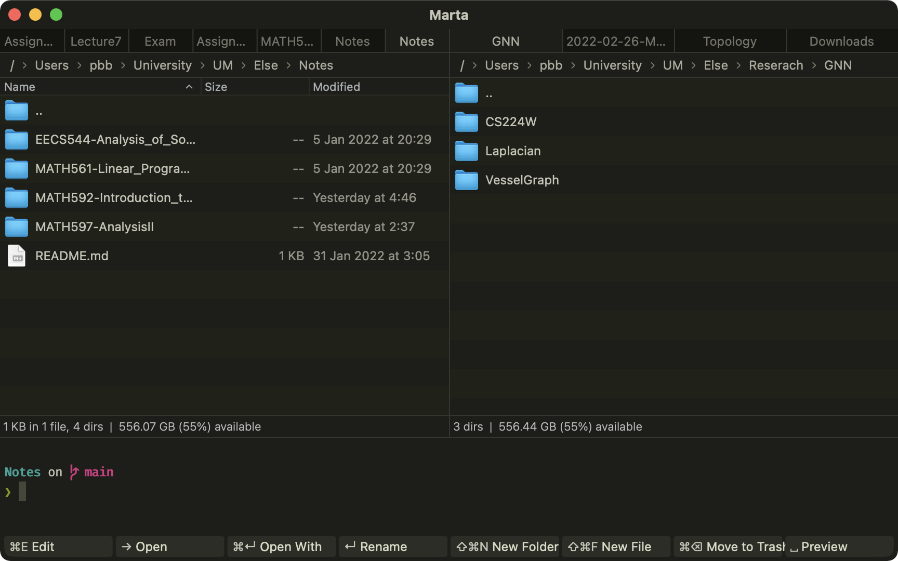
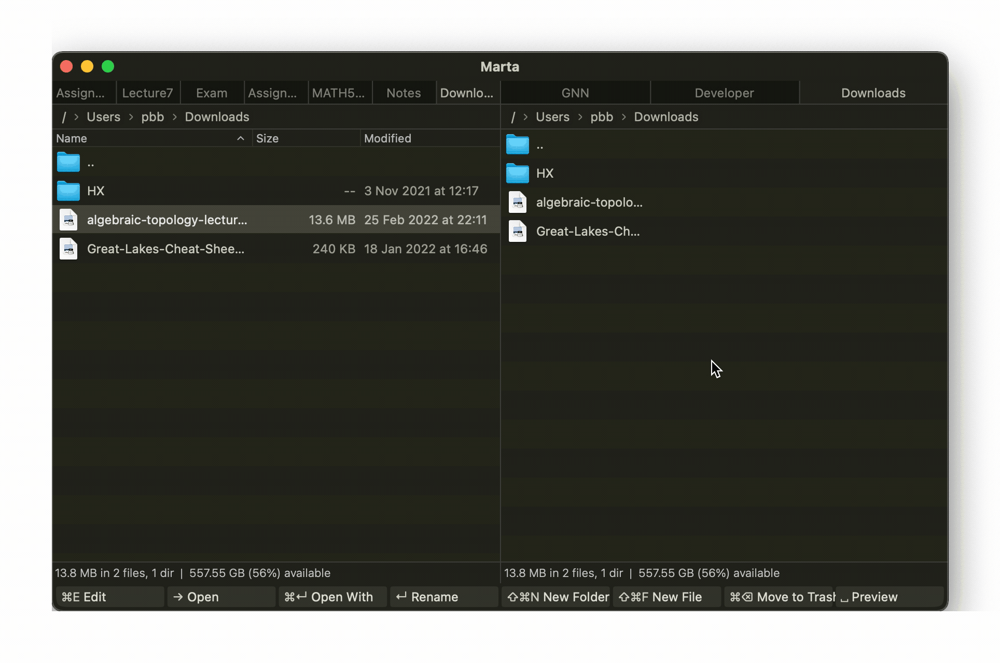
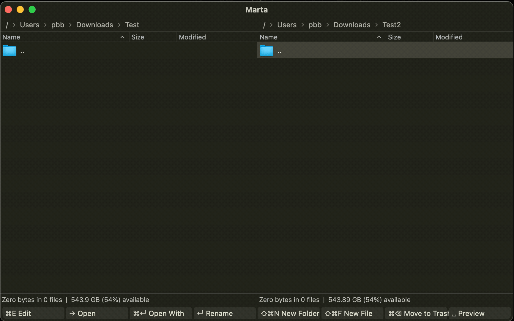
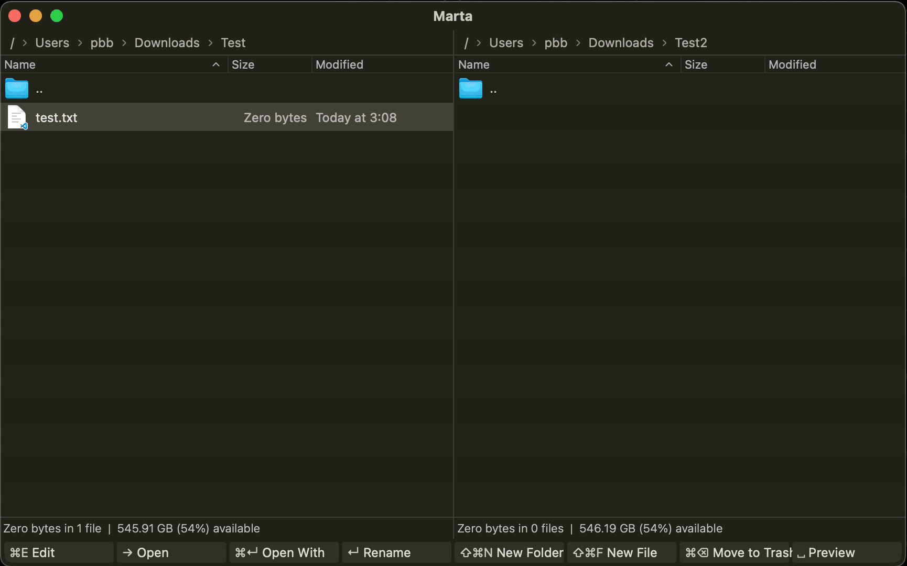

# Introduction
I have been using macOS for a straight 4 years now, though most of the design choices made by excellent Apple engineers are easy to use, and even if it's not the case, there are at least some alternatives. But Finder is different.
I asked lots of my macOS friends, and nearly all of them think Finder is fine, "it's fast and easy to use."

Every time I heard about this, I doubt they haven't seen [TotalFinder](https://totalfinder.binaryage.com/) before. Although I can write another paragraph introducing [TotalFinder](https://totalfinder.binaryage.com/) to you,
but sadly, while Apple is moving on to M1 chips, [Totalfinder](https://totalfinder.binaryage.com/) is too old to keep up with the pace to be compatible with this new chip architecture. Indeed, it stops updating and is now free to everyone since it's not maintained anymore.
There are two things [Totalfinder](https://totalfinder.binaryage.com/) done well which outperforms Finder:
1. Global hotkey support. It can be open *anywhere* by a user-defined shortcut. This is useful but can be achieved by other apps, such as [Alfred 4](https://www.alfredapp.com/).
2. Multiple tabs support with double panels display. This is especially useful if you need to move things around by keyboard. If you're using Finder, then you'll need to open multiple windows to achieve this, but now you can do the same thing with only one active window.
After some surfing, I found another alternative, [Marta](https://marta.sh/). It's better in some ways compared to [Totalfinder](https://totalfinder.binaryage.com/), but not that convenient in others. Nevertheless, it's *free*, *natively support*, and most importantly, *it's cute*!

The author of [Marta](https://marta.sh/) [Yan Zhulanow](https://yanex.org/): "this cute fox stands for quick and smart, just like [Marta](https://marta.sh/)".
<p align="center">
	
</p>

# 🦊 Marta - A Finder Alternative 🦊
As a developer and hardcore mathematician, I barely use pen and paper to write stuff, even if doing math. (Yes, this means I typeset my course note in $\LaTeX$ also, check [here](https://github.com/sleepymalc/Notes)) And 
to be efficient enough, I hate moving my hand off my keyboard, including using a Trackpad or mouse. You may ask, "Ok, so what? You can use arrow keys moving around in Finder too!" Well, this is true, in some sense. If 
you only use Finder to navigate around your files, then it may be sufficient for your usage. But if you need to open multiple tabs and want to access them quickly, then Finder is **not** the way to go for sure. It's extremely 
slow to open multiple windows and let it float around your workspace and try to use a mouse/Trackman to drag files around. Instead, I would like to do all these in a single window in a well-organized manner.

<p align="center">
	
</p>

# Features
Here, I'm going to briefly introduce some basic, but powerful features which make [Marta](https://marta.sh/) standout. For the full documentation, please check the official [docs](https://marta.sh/docs/) for reference.

The core functionality in [Marta](https://marta.sh/) is implemented as *action*, which can be realized as a command which will do something, and this can be combined with a shortcut. We'll soon see what this means.

## Navigating 
In Finder, you can use arrow keys to navigate through folders, namely 
*  `←` : Move to the parent folder
*  `→` : Move in the folder if the current focus is on a folder
* `↑/↓`: Move up and down.

You can do not only the same, but more with [Marta](https://marta.sh/)! The definition of the right key in [Marta](https://marta.sh/) in default is the `core.move.right` *action*
```JSON
"Right" "core.move.right"
```
which essentially do the same thing as in Finder. But rather, you can redefine (yes, you can **complete redefine** all the keybindings) it as 
```JSON
"Right" "core.open"
```
which can not only open a folder, which will bring you to that folder, but if your current focus is on a file, you can open it by a single `core.move.right` key! This makes life much easier, since if you want to 
open a file in Finder, you'll need to use `Cmd+o` instead.

One thing that is worth mentioning is that [Marta](https://marta.sh/) set `←` as `core.move.left`, which is a bit awkward if you are used to Finder. So instead, I change it to 
```JSON
"Left" "core.go.up"
```
which is more natural for me. 

## Create New Files/Folders
By default, you can create **any** types of file in [Marta](https://marta.sh/) by the following `new.folder` and `new.file` *actions*:
```JSON
"F7" 		"core.new.folder"
"Shift+F7" 	"core.new.file"
```
You can bind it to your favorite keybindings to match your own habits. For me, since [Totalfinder](https://totalfinder.binaryage.com/) follows the same shortcut as Finder, hence I change it to 
```JSON
"Shift+Cmd+n"   "core.new.folder"
"Shift+Cmd+f"   "core.new.file"
```
while `Shift+Cmd+n` is the default shortcut to create a new folder in Finder, but there is no such shortcut, or I should say, there is no easy way to create a new file in Finder, hence you get another 
useful shortcut!
For example, the following demo will show you how to create a simple `.txt` file.


## Find
A very clever move for [Marta](https://marta.sh/) is that they implemented some sort of fast searching. There are two kinds of search you can do in [Marta](https://marta.sh/), one is *local search*, another is *global search*.
### Local Search
If your current folder contains lots of files, you can locate any file you want quickly by ***directly typing their name***. Let me show you how to do this. 

This is extremely fast and clever!

### Global Search
What if you want to go to other directories far from your current one? You can use the function `Look UP`, which is triggered by `Cmd+p`. After you type this keybinding, a search bar will pop up, and you can search for the
place you want to go to. Notice that it can be either a file/directory. Let me show you how it's done.


## Search Action
You might feel overwhelmed for now since there are lots of *actions* and keybindings going on. But, there is actually a very nice feature provided natively in [Marta](https://marta.sh/) which helps find all the 
*actions* quickly when you forget the keybinding. When you press `Shift+Cmd+P`, a search bar named *Search Action* will pop up like this, and you can search for the *action* you want.

For example, there is a built-in `compress` *action* in [Marta](https://marta.sh/), but since I didn't compress files that often, hence I do not assign a keybinding for this. Instead, I can leave my focus on
the file I want to zip (potentially multiple files, which can be selected by using `Shift+↑/↓` as you expected) and then press `Shift+Cmd+p`, search for `Compress`. Then after pressing `Enter`, it'll zip the file for you automatically!


Now, after locating the file/folder, the next question is, how to open them?

## Open
As we mentioned before, we can open the file by `→`, but there is some subtly here, let me explain.
### Open With
Interestingly, as you just saw, [Marta](https://marta.sh/) let you go *directly in* a `.zip` file and see the content in it. What if you want to do something else about it? Like, open it by other apps to unzip? By default, we have the following.
```JSON
"Cmd+Return" "core.open.with"
```
This allows you to open a file with different apps. Personally, I use [Keka](https://www.keka.io/en/), which is a portable, powerful but light-weight file archiver. Say I just zipped the newly created `text.txt` file and want to 
unzip it, I can press `Cmd+Return`, then by selecting what app we want to open this file with. In this case, I want to open `test.txt.zip` with [Keka](https://www.keka.io/en/), then we have the following.


### Edit
For those developers, I bet you'll need to open an **entire folder** very often. And as far as I know, there is no easy way to do this in Finder. But in [Marta](https://marta.sh/), you can use the `core.edit` *action*:
```JSON
"F4" "core.edit"
```
As you might already observe, I tend to define my keybinding with the keyword's first alphabet being the same as the first alphabet of the functionality this keybinding stands for. Hence, rather than remember this weird `F4` functional key, I use 
```JSON
"Cmd+e"	"core.edit"
```

What this action `core.edit` is really doing is that after you specify a **text-editor**, which you can specify in the configuration file, it'll open whatever you're focusing on within that app. For example, I use [Visual Studio Code](https://code.visualstudio.com/) as 
my primarily IDE, so I define 
```JSON
environment {
    textEditor "Visual Studio Code"
}
```
So, if you now want to open a project, you can simply press `Cmd+e`, then it'll open this folder within your favorite IDE you specified! Let's see the demo.


### Preview
You might already notice, [Marta](https://marta.sh/) doesn't provide rich support of figures as your visual tool for file organization. But as in Finder, you can always press `Space` to open/close a quick *preview* (it's formally called *quick look*) to see 
what this file is. This works like this.


## Double Panels
If you follow all these until now, you might have one question: "So when the core feature - *Double Panels* comes into play?" Here it comes, it's extremely useful when you want to ***move your files around***. This is the most complex section, hence I leave it to the very end. 
Before we start, we introduce one of the essential shortcuts to navigate in [Marta](https://marta.sh/), `tab`. It'll send you to another panel, yup, it simply does this only! Now let's start!

### Copy
The default behavior is just like any other file manager you familiar with, i.e., `Cmd+c` for copying, and `Cmd+v` for pasting.

### Move
In case some of you didn't know, Finder **do** provide the functionality `cut`. This is done by first using `Cmd+c` like `copy`, and instead of using `Cmd+v`, you use `Opt+Cmd+v` to cut the selected content and past them to where you want.
So basically, in Finder, you can first use `Cmd+c` to copy the selected files, and then determine whether you want to past or cut them until the very end. [Marta](https://marta.sh/), on the other hand, **doesn't** provide such an *action*. 
It only provides `core.move`, and the way it's done is like following. 
1. Select the file you want to `core.move`.
2. Press the keybinding you assign to `core.move` (default is `F6`).
3. It'll pop up a small window asking you where you want to `core.move` the selected file. The default path is ***another panel's address***.

For demonstration, say I want to move the created `Test/test.txt` to my `Test2` folder. The workflow should be like this:


The big question now arises: "How can I do this efficiently? It seems like the functionality is quite limited." Now comes the crucial part, `clone` *action*.

### Clone Left/Right (folder)
The clone action is quite interesting, it includes four variations: 
1. `core.clone.left` (only works when you're at the *right* panel)
> It'll set the *left* panel to the **folder** you selected. If your current focus is on **file**, it'll simply set the *left* panel as the folder you're currently in of the *right* panel.
2. `core.clone.right` (only works when you're at the *left* panel)
> Same as `core.clone.left`, but reversed in an obvious way.
3. `core.clone.left.folder` (only works when you're at the *right* panel)
> Almost the same as `core.clone.left`, but it'll ***always*** set the *left* folder as the folder you're currently in of the *right* panel.
4. `core.clone.right.folder` (only works when you're at the *left* panel)
> Same as `core.clone.left.folder`, but reversed in an obvious way.

You can now imagine how useful this is since if you're moving files under some parent folder, then you can use `core.clone` *action* to quickly set another panel to the similar address and `core.move` files around.

## Personal Configuration
Let's see the configuration file. To open the configuration file, you can simply press `Cmd+,` in [Marta](https://marta.sh/). And to apply all my configurations, copy the following codes into the **Right** panel of the configuration file. The left hand 
side of the configuration file is the default config for reference.

```JSON
behavior {
    theme "Dark"
    
    actions {
        core.trash.confirm false
        
        core.lookup.mode "substring"
    }
    
    table {
        circularSelection true
        iconSize 24
    }
}

keyBindings {
    "Return"        "core.rename"
    "Right"         "core.open"
    "Left"          "core.go.up"
    
    "Shift+Cmd+n"   "core.new.folder"
    "Shift+Cmd+f"   "core.new.file"
    
    "Cmd+e"         "core.edit"
    "Shift+Cmd+x"   "core.move.inactive"
    "Cmd+o"         "core.open"
    "Cmd+x"         "core.move"
    
    "Shift+Cmd+t"   "core.terminal.activate"
    
    "F4"            null
    "F6"            null
    "F7"            null
    "Shift+F7"      null
    "F8"            null
    "Cmd+y"         null
    "Backspace"     null
}

environment {
    textEditor "Visual Studio Code"
}

setup {
    actionBar [
        "core.edit"
        "core.open"
        "core.open.with"
        "core.rename"
        "core.new.folder"
        "core.new.file"
        "core.trash"
        "core.preview"
    ]
}

etty {
    theme "SolarizedLight"
    fonts {
        normal [ "Fira Code" 12]
    }
}
```
### Theme
One thing I didn't bring up is that there are actually different themes you can choose from, here is some from the [official document](https://marta.sh/docs/configuration/themes/): 
1. Kon
<p align="center">
	
</p>

2. Dark
<p align="center">
	
</p>

3. Classic
<p align="center">
	
</p>

4. Sakura 🌸
<p align="center">
	
</p>

I actually quite like the look of Sakura 🌸, but since I use dark mode throughout all application, hence I just give up on this... Definitely try it out! To change the theme, 
you can either just work in the configuration file, or to [search the `Switch Theme` *action*](./posts/Marta#search-action):


# Conclusion
Overall, I think [Marta](https://marta.sh/) provides excellent customizabilities, while still easy enough for simple use. If you think you need an extra boost of productivity, 
or even just want to try out new applications, [Marta](https://marta.sh/) is definitely worth giving a shot!