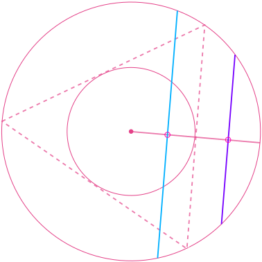
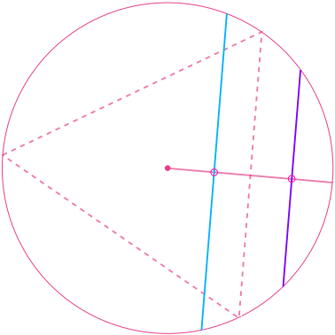
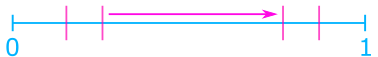
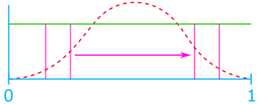
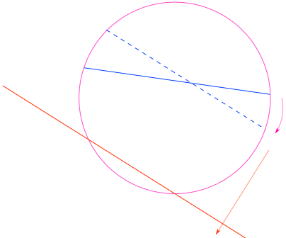

I've been working with probability intensively for the past few months, and I want to say something about the famous *Bertrand's paradox*.

## Classical Probability

In modern mathematics, there are essentially two ways of building everything from the ground up: one is set theory (e.g., [ZF-set theory](https://en.wikipedia.org/wiki/Zermelo%E2%80%93Fraenkel_set_theory)), and another is type theory (e.g., [HoTT](https://en.wikipedia.org/wiki/Homotopy_type_theory)). But these two are just subfields of *Mathematical logic*, and people have a clear idea that given $A, B$,[^1] either

$$
A\implies B\text{ or } A\;\not\!\!\!\!\implies B
$$

is true, and one of them must be true, but not both.

[^1]: Regardless of $A$ and $B$, which depend on the content (i.e., under ZF-set theory or HoTT).

Now, someone comes in and says: "*What if our information is not **complete**? At least I can deduce how **true** $P\colon A\implies B$ is if I have some information about $A$ and $B$?*" The idea of *probability* then kicks in: We try to *assign* a real value $p\in[0,1]$ between $0$ and $1$ to *measure*[^2] how true something is with some slackness.

[^2]: The word *measure* is chosen since Measure Theory is the underlying backbone of probability theory.

But something gets a bit sloppy here. In classical probability theory, the number of possible outcomes of the experiment is finite, say $N$, and if we have no information about whether one outcome will be more likely than others, then we just assign each outcome with a probability $p=1/N$ evenly without problems. This is so-called the **principle of indifference**.

### Thought Experiment: When everything is finite

Consider the experiment of *tossing coins*. If we know nothing about the coin and how others are going to toss that coin, then the probability should just be

$$
p_{\text{head}}=p_{\text{tail}}=\frac{1}{2}.
$$

But if we have some information about that coin, say, the coin is made in a way such that two sides are both heads (we don't know this, but the people tossing it knows), then for us,

$$
p_{\text{head}}^{\text{us}}=p_{\text{tail}}^{\text{us}}=\frac{1}{2},
$$

while for the person (call him $c$ for cheating 😡) tossing that weird coin,

$$
p_{\text{head}}^{c}=1,\quad p_{\text{tail}}^{c}=0
$$

in this case.

> What's really happening here is that, our information of that tossed coin is different from $c$. For $c$, there are really just one possible even outcome, while for us, there are two and there are no preferences whatsoever.

But now, if we consider the case that there are infinitely many possible outcomes, then what should we calculate the probability in *the right way*?

### Thought Experiment: When $\infty$ involves

Let's consider the following experiment: There is a black box (you can't see what's inside) containing some dice with various sides, e.g., a usual $6$-sided die, a $15$-sided, etc. I'll randomly pick one and roll it (you still can't see this process). Now, what's the probability of the result being $8$?

"*There is just not enough information!*" you might say. But after second thought, a clever student will yell at me, "*The probability is $0$ since there are infinitely many outcomes, and we can't distinguish them!*" While this is true, I think this is an excellent example to make us aware that it gets tricker when infinity involves: sometimes, the answer may not be apparent.

> As a spoiler, the main reason that we're able to find out the answer of the above cases, is because of the *principle of indifference* is well-defined.

## The Paradox

While infinity is a (potential) issue, there's something more severe and fatal. Consider the following experiment: Given a circle and an equilateral triangle inscribed in it, what is the probability that a random chord is longer than a side of the triangle?

	

While the problem may seem innocent at first look, there's an interplay between infinity and different viewpoints of probability. Nevertheless, let's try to solve this.

### First Attempt: Random Endpoints

Let's try to find a random chord in a circle first. A natural way to do this is to randomly pick two points on the circle and link them together. We see that without loss of generality, we can assume that one of the randomly chosen endpoints coincides with one vertex of the inscribed triangle (otherwise we just rotate the triangle to make this the case). Then, **we randomly choose the second endpoint on the circle and make a chord between them**.

Observe that if the other chord endpoint lies on the arc between the endpoints of the triangle side opposite the first point, the chord is longer than a side of the triangle.

 	
	 <figcaption>If the second endpoint lies on the purple arc, it's shorter; otherwise (cyan), it's longer.</figcaption>

The length of the arc is one-third of the circumference of the circle. Therefore the probability that a random chord is longer than a side of the inscribed triangle is

$$
	p_{\text{endpoint}}=\frac{1}{3}.
$$

### Second Attempt: Random Midpoints

But after a second thought, one can find out that there are multiple ways of choosing a random chord! We note that if we view it as the *midpoint* of a chord for every point in the circle, that chord can be **uniquely determined**.

Hence, **choosing a random point in the circle** corresponds to determining a random chord. Again, without loss of generality, we may assume that one side of the inscribed triangle is parallel with the chosen chord. We then see that as long as the chosen midpoint is *outside the <u>inscribed circle</u> of the triangle*, the corresponding chord is shorter; otherwise, it's longer.

	
	<figcaption>Again, purple corresponds to the shorter case, and cyan corresponds to the longer case.</figcaption>

In this viewpoint, we see that the probability that a random chord is longer than a side of the inscribed triangle is equal to the ratio between the area of the inscribed circle and the area of the original circle, which is

$$
	p_{\text{midpoint}}=\left(\frac{1}{2}\right)^2=\frac{1}{4}.
$$

### Third Attempt: Random Radial Points

This is similar to the [random midpoints method](#second-attempt-random-midpoints), but there is a subtle difference. Here, we first **choose a random radius**, and again, without loss of generality, we may assume that one side of the triangle is perpendicular to that chosen radius. Then, we **choose a random point on that radius (a radial point)** and make it the midpoint of the chord. The chord is unique, as we mentioned in the [random midpoints method](#second-attempt-random-midpoints), and for the same reason, if the chosen point is on the inner half of the radius, then the corresponding chord is longer; otherwise, it's shorter.

	
	<figcaption>Purple corresponds to the shorter case, and cyan corresponds to the longer case.</figcaption>

But we see that the calculation is different. The probability that a random chord is longer than a side of the inscribed triangle is equal to simply

$$
	p_{\text{radial-point}}=\frac{1}{2},
$$

since we choose that random point on the radius uniformly, and from elementary geometry, the edge of the triangle split the radius in half exactly.

## Experiment

I encourage you to try to simulate the above three *processes* yourself [here](https://1-10000th.com/bertrand_paradox/).

## What's going on?

This is known as *Bertrand's Paradox*. Different **processes** of choosing a random chord correspond to different results, and every process seems correct.

What I'm going to say may disappoint you, but this is a philosophical question rather than a mathematical paradox: There are just (mainly) two different viewpoints in probability: *frequentist probability*, and *Bayesian probability*.

### Frequentist Probability

In the frequentist interpretation, probabilities are discussed only when dealing with well-defined random experiments. The set of all possible outcomes of a random experiment is called the sample space of the experiment. An event is a subset of the sample space to be considered. Only one of two possibilities may hold for any event: it occurs or not. The relative frequency of occurrence of an event, observed in several repetitions of the experiment, is a measure of the probability of that event. This is the core conception of probability in the frequentist interpretation.

The frequentist approach claims that, as the number of trials increases, the change in the relative frequency will diminish. Hence, one can view probability as the limiting value of the corresponding relative frequencies.

### Bayesian Probability

In contrast to frequentist interpretation, here, Bayesian probability is interpreted as reasonable expectation representing a state of knowledge or as quantification of a personal belief. Namely, this is the idea of an ***extension of propositional logic***, with the propositions' truth or falsity being unknown.

> There are more subcategories in probability, but it's too involved...

### Interpretation

In the view of frequentist probability, the original problem is not well-defined in the sense that we don't know *what exactly the experiment corresponds to random chords is*. As shown above, [random endpoints](#first-attempt-random-endpoints), [midpoints](#second-attempt-random-midpoints), and [radial point methods](#third-attempt-random-radial-points) all make sense, and who knows whether these three are all *reasonable* random experiments? Maybe there are more; we just don't know.

In particular, we see that the difference between midpoints and radial point methods is exceptionally subtle: the reasoning and the key feature (uniqueness of a chord corresponding to a midpoint) are the same, but just with the different *processes*, the answer is different.

But for someone who believes that there is a ***right way*** to do probability in every scenario (Bayesian probability 👀), this problem is well-defined enough in the sense that the probability should reveal what's the state of our knowledge of a particular problem and how much can we exploit it and make it into our expectation of belief, so the probability in its nature should be able to answer questions with subtly (in this case, not well-specified random experiment).

## Discussion

### Intuition of the Issue

An intuitive way to see why $\infty$ causes this paradox is the following: imaging you can **really** *randomly* choose chords on a circle, and let's say we label every chord with a number and then choose a random number instead.[^3]

We first note that there are uncountable possible different chords, so we may label every chord with a real number between $[0,1]$.[^4] Then, the ambiguity immediately arises: How should we assign the pairing between the real number and the chords? Since they are infinitely many real numbers and chords, we're extremely flexible in terms of assigning them. For example, I can make $[0,0.999999]$ pairing with chords that are all chords passing the center of the circle (namely all diameters) while making $0.999999,1$ pairing with all other chords or another way around. Effectively, we're **choosing the distribution** in this pairing, making us biased toward some chords hence not uniformly random.

[^3]: This will not bring in additional complexity if we do it in an isomorphic way.
[^4]: Under the [Continuum hypothesis](https://en.wikipedia.org/wiki/Continuum_hypothesis) with ZFC set theory, $\mathbb{R}$ is the smallest possible set to do this.

### Critique on Bayesian Probability

[Edwin Thompson Jaynes](https://en.wikipedia.org/wiki/Edwin_Thompson_Jaynes)[^5] is very opinionated about the **right way** to do statistics or to interpret probability (in a Bayesian way), so he came up with the idea of the **maximum ignorance** principle to tackle this paradox. Maximum ignorance says that we can't assume anything if the problem is not specified, and he argued that we could use such a principle to do probability without any ambiguity.

So, in this case, the answer should be the same concerning translation (since we should be able to move our circle in space) and scale (we can scale the circle in space) invariant. Indeed, in one of his works, he concluded that the [radial points method](#third-attempt-random-radial-points) is the correct one to model this since it equipped with *translational* and also *scale* invariant.[^6]

[^5]: Who wrote the book [Probability Theory-The Logic of Science](https://bayes.wustl.edu/etj/prob/book.pdf).
[^6]: He argued that the radius points method has translational and scale invariant by a geometric argument, which is fine.

But the truth is the idea of maximum ignorance, which induces *scale**and*translation* invariant, can still yield another answer since it still depends on the underlying procedure of random selection that one uses. In particular, Alon Droy shows that each of the solutions can be derived using rotational, scaling, and translational invariance; hence the maximum ignorance principle is just as subject to interpretation as the principle of indifference itself.

### Dealing with Randomness with $\infty$

> This is the only section where abstract is involved

From the discussion, how do we know that we're safe when dealing with things like "*choosing ___ randomly*"? The answer is if there is an apparent *symmetry* in that space, and we want our distribution to be *invariant* to that symmetry.

For example, if we say *choose a real number in $[0,1]$ randomly*, there should be no ambiguity since, in $[0,1]$, there is one clear symmetry: the translation.

	
	<figcaption>For any little interval, moving it will not change its topological structure.</figcaption>

Hence, uniform distribution w.r.t. this randomness needs to be translational invariance as well.

	
	<figcaption>The green distribution is uniform, while the orange one is not.</figcaption>

In a formal algebraic language, the invariant w.r.t. the symmetry corresponds to whether the <u>group of symmetry acts ***transitively*** on the space</u>.[^7] In the above uniform example, we can choose any $\Delta$ such that it can take me from $a$ to $b$ by setting $a+\Delta\coloneqq b$, where $a,b\in[0,1]$. Hence, as long as the space we're working on has a clear symmetry while this symmetry acts transitively (with the technical *compactness* condition), we're safe.

[^7]: An additional condition is that the space must be *compact* to be safe, but it's a bit technical here.

As in our example, we're trying to find a group of symmetry that acts as *transitively* on the space of **chords** as possible. In the first two methods, we have rotational symmetry, but Jaynes argued that they're not the answer since only rotational symmetry is not enough.

	
	<figcaption>Only rotational symmetry does not act transitively on chords since a shorter chord can't be transformed into a longer one and vice versa.</figcaption>

While for the last method, we have translational symmetry in addition, as shown by Jaynes. And we immediately see that with translational symmetry, we can turn any chord into another by translation and rotation.

	
	<figcaption>We transform the orange chord into the blue one by rotating the circle and then translating it within the space.</figcaption>

## Final Words

Personally, though I like the idea of the **extended mathematical logic** interpretation of probability such that probability is a model of knowledge, I think that this is asking something beyond its capability.
