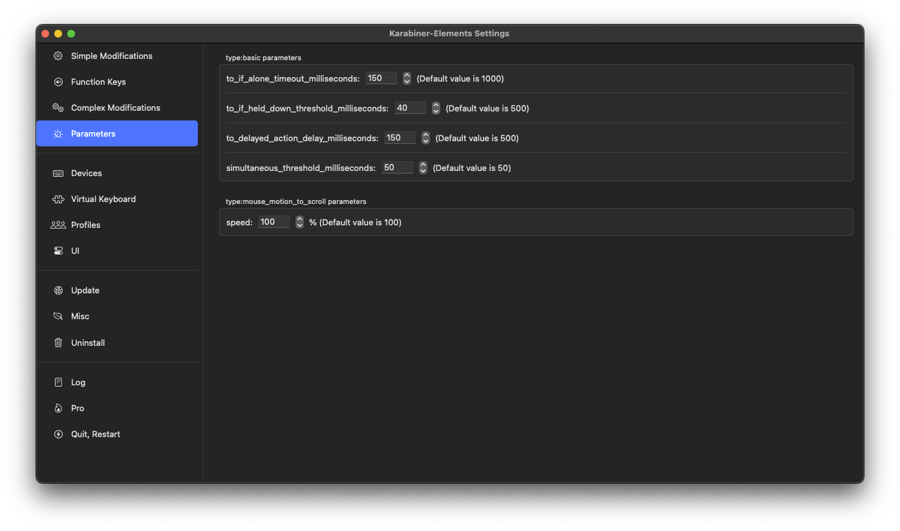

## Introduction

Do you think typing fast, i.e., achieving a high wpm (high word-per-minutes), is the only way to be efficient/productive? If you do, then this compact, 5-mins read post will blow your mind, making you *even faster*.[^1]

[^1]: In the sense of efficiency, go without saying.

### Mentality

What I'm going to share is not about how you can be fast in regular typesetting, e.g., achieving wpm 150 in [monkeytype](https://monkeytype.com). Rather, it's about some of the most fundamental editing-related key remaps I have done.

> If you have read the post about [VSCode-LaTeX-Inkscape](./VSCode-LaTeX-Inkscape) and are still wondering how I can typeset these [notes](./Notes) in class, here it is: this is my only secret left.

Before walking through my key remaps one by one, I want to give you the mentality you should have when adapting my settings: Your hands should move **as little as possible**. You might already hear this multiple times, but you should bring this to an **extreme**, i.e., staying your hand on the main row (i.e., right index finger on `f`, left index finger on `j`) is the *bare minimum* you should achieve.

Let me ask you: *How do you typically delete a character?* If you

use <code>delete</code> (<code>backspace</code>) with your right little finger traveling across 2 columns and 2 rows,

then you should keep reading.

### Tool matters

First thing first, please get yourself a good keyboard. I use [HHKB](https://happyhackingkb.com/) Professional Hybrid Type-S personally. It's fast, elegant, and customizable. Moreover, the revolutionary layout is awesome.[^hhkb]

	

[^hhkb]: If you're interested in learning more about [HHKB](https://happyhackingkb.com/), go to [hhkb.io](https://hhkb.io).

### The Setup

I will use macOS and [Karabiner-Elements](https://karabiner-elements.pqrs.org/) as our working example, but the same concept should be easily ported to other operating systems. The following is a snapshot of my setting.

	

You can easily import these settings [at the end](#import-settings), which can be used as your own setting's starting point. Now, let's walk through them one by one.

## Use `right cmd`

Have you ever used your right `cmd`?

### Arrow Keys

I hope you use [Vim](https://www.vim.org/), or at least heard about it. If you're introducing [Vim](https://www.vim.org/) to others, the first thing you might say is that

instead of using <code>←</code>/<code>↓</code>/<code>↑</code>/<code>→</code>, we now use <code>h</code>/<code>j</code>/<code>k</code>/<code>l</code> (in normal mode)!

Now the question is, ***WHY***? Well, imagine you're editing texts, and want to change something 3 characters before the cursor, what should you do? Using arrow keys would be a natural choice if you're not in [Vim](https://www.vim.org/). But remember that your arrow keys are *far away* from the ***main row*** of your keyboard.

To address this, we simply adapt [Vim](https://www.vim.org/)'s solution, i.e., using `h`/`j`/`k`/`l` as arrow keys. However, unlike in [Vim](https://www.vim.org/) where we have *normal mode* and *insert mode* so using `h`/`j`/`k`/`l` as arrow keys in *normal mode* would not be a problem. Contrarily, we now need to maintain the ability to insert alphabets `h`/`j`/`k`/`l`. The solution is also simple: *use a modifier*. I use `right cmd`+`h`/`j`/`k`/`l` as `←`/`↓`/`↑`/`→`.

You might notice that I use the `right cmd` instead of just `cmd`. This is because `cmd`+`h`/`j`/`k`/`l` might be your other shortcuts, and entirely overloading them to arrow keys is not ideal. Hence, by specifying only `right cmd`+`h`/`j`/`k`/`l` as arrow keys, it

- preserve the potential shortcuts; and
- `right cmd`+`h`/`j`/`k`/`l` only uses your right hand which is very natural (you just need to press the `right cmd` with your right thumb, and you can use arrow keys just like you're in [Vim](https://www.vim.org/) **wherever you are**).

### Math-Related Characters

We saw that you can use your `right cmd` as a special modifier, and now we want to extend this theme. I typeset math-related characters quite often, e.g., `=`, `+`/`-`, `^`/`_`, `(`/`)`, `[`/`]`, and `{`/`}`. Most of them are on the top row and need a modifier (usually `shift`). And this is not very intuitive and still, some of them (e.g., `+`/`=` and `-`/`_`) are far from the main column (w.r.t. your little finger) and the main row. So, I use

1. `right cmd`+`g` for `=`;
2. `right cmd`+`e`/`c` for `+`/`-`;
3. `right cmd`+`r`/`v` for `^`/`_`;
4. `right cmd`+`d`/`f` for `(`/`)`;
5. `right cmd`+`a`/`s` for `{`/`}`;
6. `right cmd`+`q`/`w` for `[`/`]`;

Here is my justification for this setup:

- It's easy to type: All of them are around the main row of your left hand (and your right hand is only responsible for the `right cmd`).
- It's easy to remember: They're quite symmetric (e.g., `^` is `right cmd`+`r` while `_` is `right cmd`+`v`, up and down, respectively).
- It's more accurate: It's not easy to type `-`/`_` and `+`/`=` on the first try with your right little finger in the ordinary setup.
- It's more comfortable: The most frequently used characters, i.e., `^`/`_` and `+`/`-`, are configured to your index finger and middle finger, respectively.

## Long and Short Press

If you notice that some keys are only designed for long-press but never exploit it, then keep reading.

### Escape

Again, if you use [Vim](https://www.vim.org/), then you will need to use `esc` intensively. Hence, some might suggest you go remap the `caps lock` to `esc`.

However, in my case, I'm using [HHKB](https://happyhackingkb.com/), i.e., the usual position for `caps lock` is `control`.

	

> To make thing consistent, I also remap `caps lock` on my MacBook to `control`.

So, should we directly remap `control` to `esc`? No! Observe that `control` is used as a modifier, i.e., you never click `control` on its own. By exploiting this fact, we can

set <code>control</code> to be <code>esc</code> if it's pressed alone.

Specifically, if I press `control` for less than a threshold called `alone threshold` (e.g., 0.15 seconds), then it'll be recognized as `esc`; and if I press `control` for more than a threshold called `hold-down threshold` (e.g., 0.04 seconds), then it'll be recognized as `control` and can then be used as a modifier.[^2]

[^2]: You might notice that it's possible to have conflict, i.e., if you press `control` for 0.1 seconds, then it'll trigger both `control` and `esc`. However, it's fine since `control` is a modifier but is not combined with `esc`. You don't want your `hold-down threshold` to be too long (e.g., 0.15 seconds to avoid conflict) because then whenever you want to actually use `control` as a modifier combined with other keys to trigger a shortcut, you'll need to hold `control` for that long.

### Right Shift

## Import Settings

I don't know any easy (i.e., 1-click) way to import setting from a profile with [Karabiner-Elements](https://karabiner-elements.pqrs.org/), but the basic steps are the following.

1. Open [Karabiner-Elements](https://karabiner-elements.pqrs.org/), go to *Misc* and click on *Export & Import*.
    

		
	

2. Copy [`Alone.json`](./How2TypeFast/Alone.json), [`Double.json`](./How2TypeFast/Double.json), [`Right-Cmd.json`](./How2TypeFast/Right-Cmd.json) into `.config/karabiner/assets/complex_modifications`.[^3]
    

		
	

3. Again open [Karabiner-Elements](https://karabiner-elements.pqrs.org/), go to *Complex Modifications* and click on *Add rule*.
	

		
	

4. You should be able to enable these rules easily.
	

		
	

[^3]: If you came from [VSCode-LaTeX-Inkscape](./VSCode-LaTeX-Inkscape#karabiner-elements), then you add [`Inkscape.json`](./How2TypeFast/Inkscape.json) into `.config/karabiner/assets/complex_modifications`.

Finally, my you can also set up your *Parameters* as mine:

	

