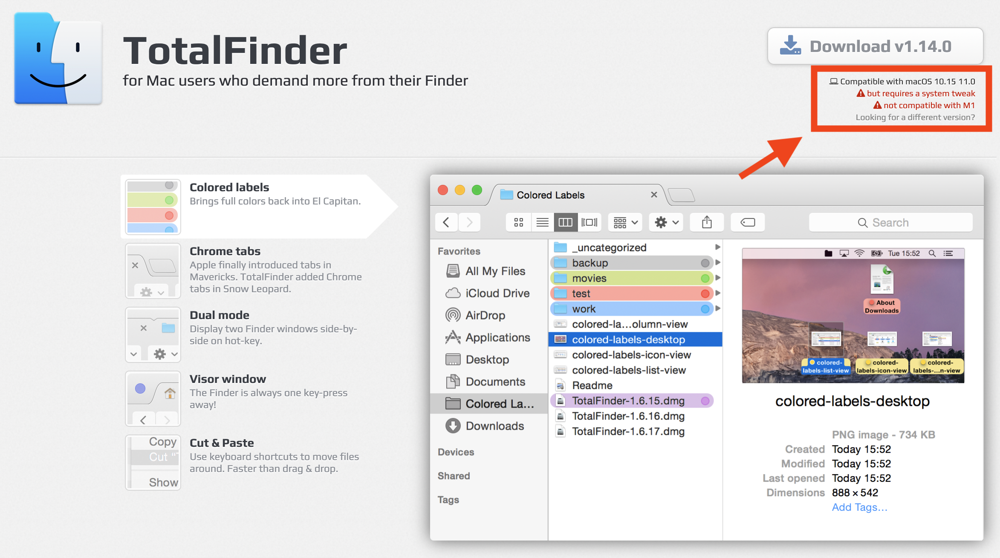
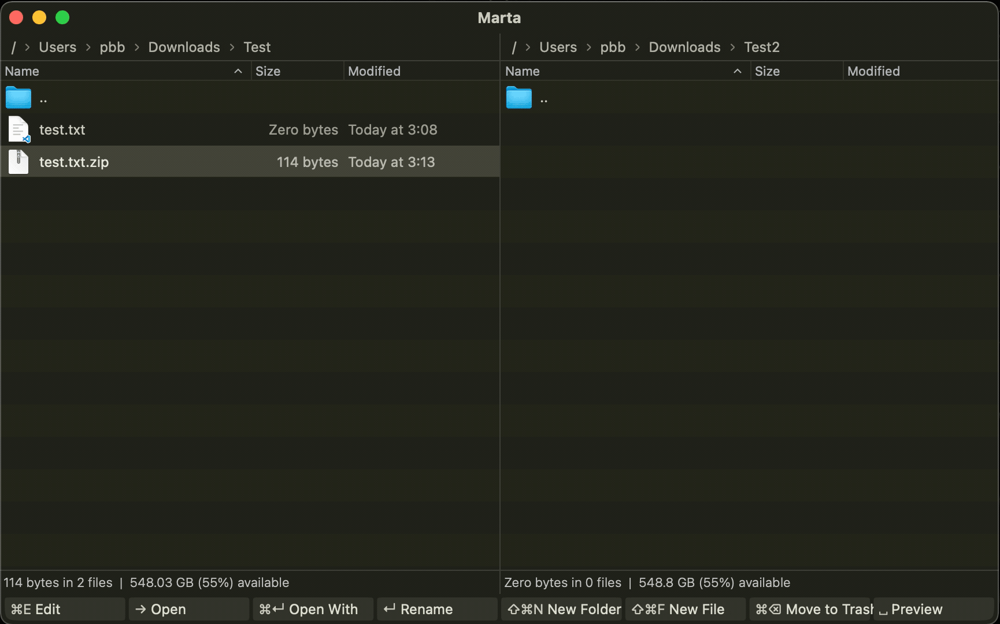
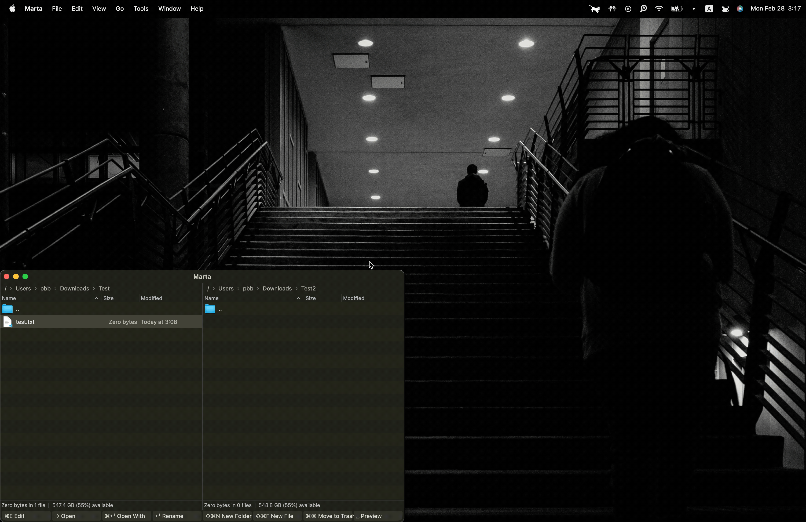
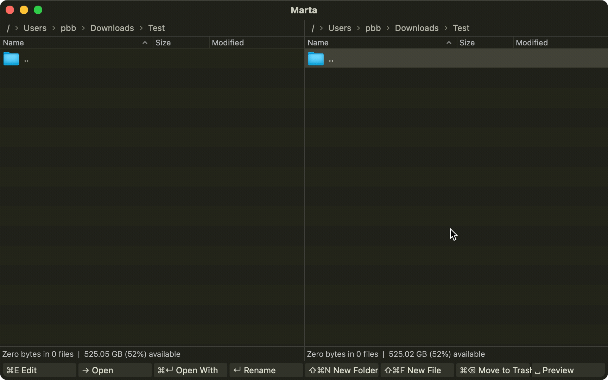
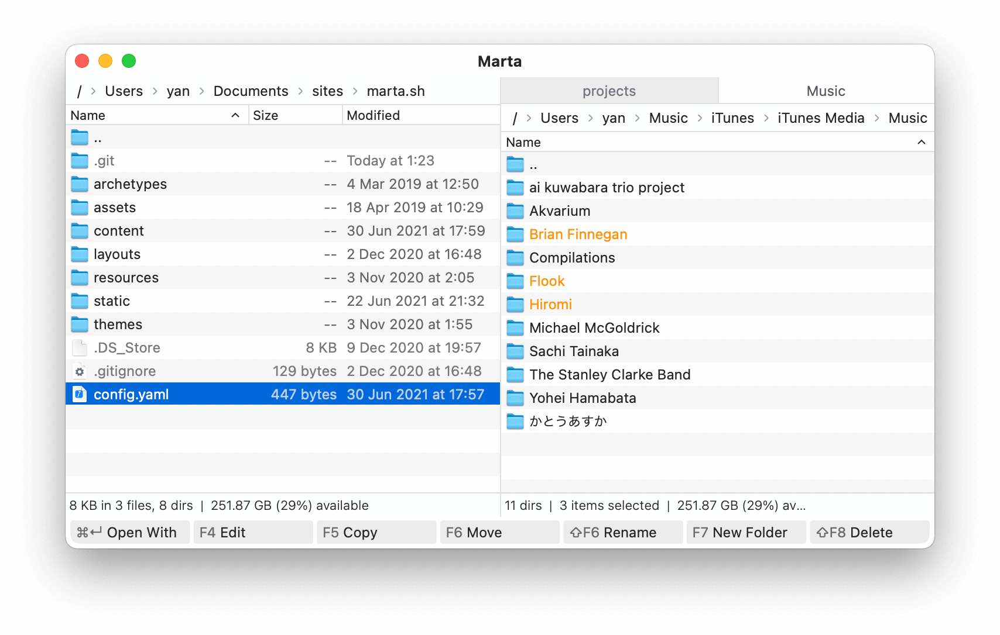
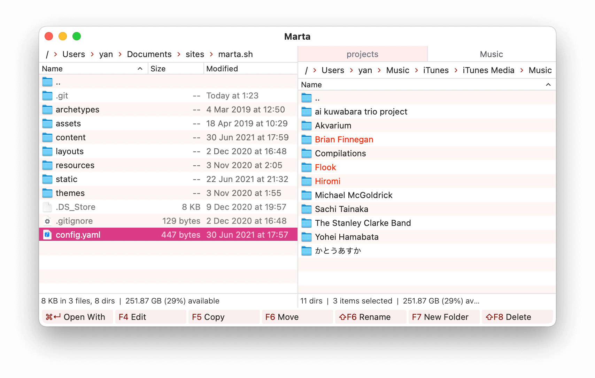

# 🦊 Marta - A Finder Alternative 🦊

<p align="center">
	
</p>

Though most of the native apps made by excellent Apple engineers are easy to use[^1], but Finder is different. I asked lots of my macOS friends, and nearly all of them think Finder is great, "*it's fast and easy to use.*" Every time I heard about this, I doubt they haven't seen [TotalFinder](https://totalfinder.binaryage.com/) before.
> Although I can write another paragraph introducing [TotalFinder](https://totalfinder.binaryage.com/) to you, but sadly, while Apple is moving on to arm architecture, [TotalFinder](https://totalfinder.binaryage.com/) couldn't keep up with the pace to be compatible with Apple. Indeed, it stops updating and not maintained anymore.[^2] (~~Things can be changed!!! See this [post](https://twitter.com/akemin_dayo/status/1467946268181753859) and [this](https://discuss.binaryage.com/t/totalfinder-on-m1-macbook-air/7879/12)~~ Things just changed!!! See [here](#alternatives)!)
> <p align="center">
> 	
> </p>

[^1]: Even if it's not the case, there are at least some alternatives.
[^2]: But it's now free though... 😂

## Why Marta?

<p>

</p>

The fundamental difference between [TotalFinder](https://totalfinder.binaryage.com/) and Finder is the **multiple tabs support** with **double panels display**, which allows you to manage files *purely by keyboard*. If you're using Finder, you'll need multiple windows and probably with mouse to achieve this, but now you can do the same thing with only one active window.

Though [TotalFinder](https://totalfinder.binaryage.com/) is no longer available for arm mac, [Marta](https://marta.sh/) appeared. It's better in some ways compared to [TotalFinder](https://totalfinder.binaryage.com/), but not that convenient in others. Nevertheless, it's *free*, *natively support*, and most importantly, *it's cute*! The author of [Marta](https://marta.sh/) [Yan Zhulanow](https://yanex.org/): "this cute fox stands for quick and smart, just like [Marta](https://marta.sh/)".

> If you ask, "*Ok, so what? You can use arrow keys moving around in Finder too!*" Well, then in this case, Finder may be sufficient for your usage.

## Features

I'm going to briefly introduce some basic but powerful features in [Marta](https://marta.sh/). For the full documentation, please check the official [docs](https://marta.sh/docs/) for reference. First, this is the basic look of your Marta window:

<p align="center">
	
</p>

### Actions

The core functionality in [Marta](https://marta.sh/) is given as *action*, which can be realized as commands and can be triggered with shortcuts. There are enormous amounts of *actions* provided, and all of them can be arbitrarily combined to your favorite keybindings and triggered effortlessly.

### Search Actions

You might sometimes get lost when you are working with  [Marta](https://marta.sh/) since there are so many *actions* can be used, and you have many keybindings to each of them. But don't worry, there is a very nice feature provided natively in [Marta](https://marta.sh/) which helps you find any *action* in no time: that is the *Search Action*.

When you press `shift`+`cmd`+`p`, a search bar named *Search Action* will pop up, and you can search any *action* you want to use. For example, there is a built-in `Compress` *action* in [Marta](https://marta.sh/), but since I didn't compress files that often, hence I do not assign a keybinding to this. Do not panic if you suddenly want to compress some files! You can select files[^3] you want to zip and then press `shift`+`cmd`+`p`, search for `Compress` and use `enter` to trigger the action:

[^3]: To select multiple files, you select them by using `shift`+`↑`/`↓` as expected.

<p align="center">
	
</p>

Now, let's start binding some useful *actions* to your favorite keybindings!

### Navigating

In Finder, you can use arrow keys to navigate through folders, namely

* `←` : Move to the parent folder.
* `→` : Move in the folder if the current focus is on a folder (otherwise do nothing).
* `↑` : Move up.
* `↓` : Move down.

You can do not only the same, but more with [Marta](https://marta.sh/)! The definition of the right key in [Marta](https://marta.sh/) in default is the `core.move.right` *action*

```JSON
"Right" "core.move.right"
```

which essentially do the same thing as in Finder. But rather, you can redefine (yes, you can **completely redefine** all the keybindings) it into `core.open` *action* by

```JSON
"Right" "core.open"
```

which can not only bring you into that folder, but if your current focus is on a file, you can also open it! This makes life much easier.
> If you want to open a file in Finder, you'll need to use `cmd`+`o` instead.

One thing that is worth mentioning is that [Marta](https://marta.sh/) set `←` as `core.move.left`, which is a bit awkward if you are used to Finder. So instead, I change it to

```JSON
"Left" "core.go.up"
```

which essentially do the same thing as Finder.

### Create New Files & Folders

By default, you can create folders and **any** types of file in [Marta](https://marta.sh/) by the following `new.folder` and `new.file` *actions*:

```JSON
"F7" 		"core.new.folder"
"Shift+F7" 	"core.new.file"
```

You can bind it to your favorite keybindings to match your own habits. For me, since [TotalFinder](https://totalfinder.binaryage.com/) follows the same shortcut as Finder, hence I change it to

```JSON
"Shift+Cmd+n"   "core.new.folder"
"Shift+Cmd+f"   "core.new.file"
```

while `shift`+`cmd`+`n` is the default shortcut to create a new folder in Finder, but there is no such shortcut, or I should say, there is no easy way to create a new file in Finder, hence you get another useful shortcut! The following demo will show you how to create a new folder and a simple `.txt` file.

<p align="center">
	
</p>

### Find

A very clever move for [Marta](https://marta.sh/) is that they implemented some sort of fast searching. There are two kinds of search you can do in [Marta](https://marta.sh/), one is *local search*, another is *global search*.

#### Local Search

If your current folder contains lots of files, you can locate any file you want quickly by ***directly typing their name***. Let me show you how to do this.

<p align="center">
	
</p>

This is extremely fast and clever!
> Note that Finder does support this feature, but it does not do well in some cases. Marta does it more consistent and intuitively.

#### Global Search

What if you want to go to other directories far from your current one? You can use the function `Look UP`, which is triggered by `cmd`+`p`. After you type this keybinding, a search bar will pop up, and you can search for the place you want to go to. Notice that it can be either a file or directory.

<p align="center">
	
</p>

Now, after locating the file/folder, the next question is, how to open them?

### Open

As we mentioned before, we can open the file by `→`, but there is some subtly here, let me explain.

#### Open With

Interestingly, as you're going to see, [Marta](https://marta.sh/) let you go *directly in* a `.zip` file and see the content in it with the `core.open` *action*. What if you want to do something else about it? Like, open it by other apps to unzip?

Thankfully, we have the `core.open.with` *action* by default:

```JSON
"Cmd`+`Return" "core.open.with"
```

This allows you to open a file with different apps. Personally, I use [Keka](https://www.keka.io/en/), which is a portable, powerful but light-weight file archiver. Say I just zipped the newly created `text.txt` file and want to unzip it, I can press `cmd`+`Return`, and search for the app I want to open this file with. In this case, I want to open `test.txt.zip` with [Keka](https://www.keka.io/en/):

<p align="center">
	
</p>

#### Edit

For developers, I bet you'll need to open an **entire folder** very often. And as far as I know, there is no easy way to do this in Finder. But in [Marta](https://marta.sh/), you can use the `core.edit` *action*:

```JSON
"F4" "core.edit"
```

As you might already observe, I tend to define my keybinding with the keyword's first alphabet being the same as the first alphabet of the functionality this keybinding stands for. Hence, rather than remember this weird `F4` functional key, I use `cmd`+`e` to do the `core.edit` *action*:

```JSON
"Cmd+e" "core.edit"
```

What `core.edit` is really doing is that after you specify a **text-editor**, which you can specify in the configuration file, it'll open whatever you're focusing on within that app.[^4] For example, I use [Visual Studio Code](https://code.visualstudio.com/) as my primarily IDE, so I define

[^4]: That's to say, you can also open a file with the **text-editor** you specified.

```JSON
environment {
    textEditor "Visual Studio Code"
}
```

So, if you now want to open a project, you can simply press `cmd`+`e`, then it'll open this folder within your favorite IDE you specified! Let's see the demo.

<p align="center">
	
</p>

#### Preview

You might already notice, [Marta](https://marta.sh/) doesn't provide rich support of figures as your visual tool for file organization. But as in Finder, you can always press `space` to open/close a quick *preview* (it's formally called *quick look*) to see what this file is. This works like this.

<p align="center">
	
</p>

> I need to admit, the preview column provided by Finder is quite useful in some cases...

### Double Panels

If you follow all these until now, you might have one question: "So when the core feature - *Double Panels* comes into play?" Here it comes, it's useful in the following two ways

1. Tabs (Pages) support.
2. ***Move your files around***.

This is the most complex section, hence I leave it to the very end. We start by introducing tabs.

#### Tabs

For short, you can open several tabs in *each* panel. And with one of the essential shortcuts to navigate in [Marta](https://marta.sh/), `tab`, which essentially will send you to another panel, you can achieve the following.

<p align="center">
	
</p>

Yes, it's simple but powerful! In the demo, I use `cmd`+`t` to create a new tab while using `cmd`+`w` to close it. Further, I use `opt`+`cmd`+`←` and `opt`+`cmd`+`→` to navigate between tabs. With this in mind, we now see how you can utilize this to speed up the process of moving files around.

#### Copy & Pasting

The default behavior is just like any other file managers you familiar with, i.e., `cmd`+`c` for copying, and `cmd`+`v` for pasting. But I have done one tweak relates to copy: I assign `opt`+`cmd`+`c` to copy the *path* of the current focus file/folder by combining this keybinding with `core.path` as follows:

```JSON
"Cmd+Opt+c" "core.path"
```

This is quite useful and fast!

#### Move (Cut-like)

In case some of you didn't know, Finder **do** provide the functionality `cut`. This is done by first using `cmd`+`c` like `copy`, and instead of using `cmd`+`v`, you use `Opt+cmd`+`v` to cut the selected content and past them to where you want.
>So basically, in Finder, you can first use `cmd`+`c` to copy the selected files, and then determine whether you want to past or cut them until the very end.

[Marta](https://marta.sh/), on the other hand, **doesn't** provide such an *action*. It only provides `core.move`, and the way it's done is like following.

1. Select the file you want to `core.move`.
2. Press the keybinding you assign to `core.move` (default is `F6`, I reassign it to be `cmd`+`x`).
3. Type the path you want to `core.move` the selected files (can include folders) to. The default path is ***another panel (current tab)'s path***.

For demonstration, say I want to move the created `Test/test.txt` to my `Test2` folder. The workflow should be like this:

<p align="center">
	
</p>

#### Clone

As you can see, [Marta](https://marta.sh/) want you to handle your file-reorganization by utilizing its **double panels** feature. So, there must be a way to create a tab to the other side of your panel quickly, maybe? Indeed! It's exactly the `clone`-related *actions*, which include four variations:

1. `core.clone.left` (only works when you're at the *right* panel)

    It'll set the *left* panel to the **folder** you selected. If your current focus is on **file**, it'll simply set the *left* panel as the folder you're currently in.
2. `core.clone.right` (only works when you're at the *left* panel)

    Same as `core.clone.left`, but reversed in an obvious way.
3. `core.clone.left.folder` (only works when you're at the *right* panel)

    Almost the same as `core.clone.left`, but it'll ***always*** set the *left* panel as the folder you're currently in.
4. `core.clone.right.folder` (only works when you're at the *left* panel)

    Same as `core.clone.left.folder`, but reversed in an obvious way.

Now, if you're moving files around under some parent folder, then you can use `core.clone` *action* to quickly set another panel to the similar path and `core.move` files around fast.

## Personal Configuration

Let's see the configuration file. To open the configuration file, you can simply press `cmd`+`,`. To apply all my configurations, copy the following codes into the **Right** panel of the configuration file.
> The left-hand side of the configuration file is the default config for reference.

```JSON
behavior {
    theme "Kon"
    
    actions {
        core.trash.confirm false
        
        core.lookup.mode "substring"
    }
    
    table {
        circularSelection true
        iconSize 24
    }
}

keyBindings {
    "Return"        "core.rename"
    "Right"         "core.open"
    "Left"          "core.go.up"
    
    "Shift+Cmd+n"   "core.new.folder"
    "Shift+Cmd+f"   "core.new.file"
    
    "Cmd+e"         "core.edit"
    "Shift+Cmd+x"   "core.move.inactive"
    "Cmd+o"         "core.open"
    "Cmd+x"         "core.move"
    "Cmd+Opt+c"     "core.path"
    
    "Shift+Cmd+t"   "core.terminal.activate"
    
    "F4"            null
    "F6"            null
    "F7"            null
    "Shift+F7"      null
    "F8"            null
    "Cmd+y"         null
    "Backspace"     null
    
    "Cmd+Opt+Right" "core.tab.next"
    "Cmd+Opt+Left"  "core.tab.previous"
}

environment {
    textEditor "Visual Studio Code"
}

setup {
    actionBar [
        "core.edit"
        "core.open"
        "core.open.with"
        "core.rename"
        "core.new.folder"
        "core.new.file"
        "core.trash"
        "core.preview"
    ]
}

etty {
    theme "SolarizedLight"
    fonts {
        normal [ "Fira Code" 12]
    }
}
```

## Theme

One thing I didn't bring up is that there are actually different themes you can choose from, here is some from the [official document](https://marta.sh/docs/configuration/themes/):

1. Kon

<p align="center">
	
</p>

2. Dark

<p align="center">
	
</p>

3. Classic

<p align="center">
	
</p>

4. Sakura 🌸

<p align="center">
	
</p>

I actually quite like the look of Sakura 🌸, but since I use dark mode as my main theme, hence I just give up on this... Definitely try it out! To change the theme, you can either just change the `tmeme` (the first line in my [personal configuration](#personal-configuration)) in the configuration file, or to search the `Switch Theme` *action*:

<p align="center">
	
</p>

## Conclusion

Overall, I think [Marta](https://marta.sh/) provides excellent customization abilities, while still easy enough for simple use. If you think you need an extra boost of productivity, or even just want to try out new applications, [Marta](https://marta.sh/) is definitely worth giving a shot!

## Alternatives

Here, I'm going to list some alternatives of Finder, you can try them yourself!

1. [TotalFinder](https://totalfinder.binaryage.com/)

   Just find out that the [TotalFinder](https://totalfinder.binaryage.com/) is back! See the [discussion thread](https://discuss.binaryage.com/t/update-discussion-totalfinder-1-14-2-for-apple-silicon-and-intel/8364) to see how to download it! I'll probably use **both**: Namely to replace Finder with [TotalFinder](https://totalfinder.binaryage.com/) and still use [Marta](https://marta.sh/) as my main tool to organize my files.
3. [QSpaces](https://qspace.awehunt.com/en-us/index.html)
