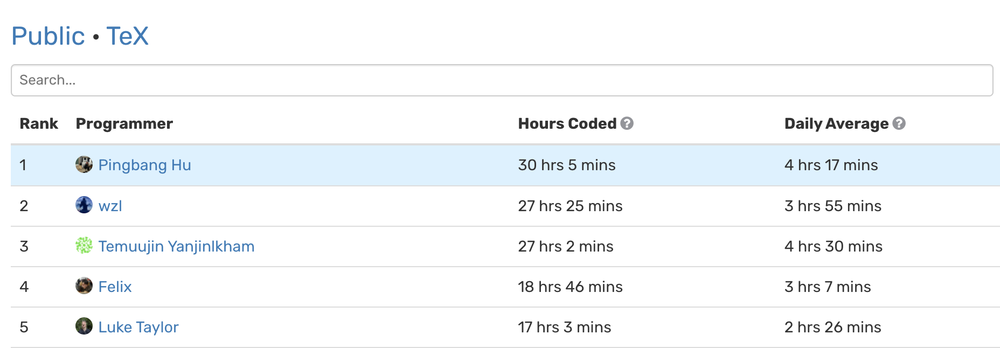

# Abstract
I'm just a regular student who is stressed and can't fall asleep every night. I have lots to say to this world, but no one is listening, not because people intended ignoring me, just because I'm not that important, and we all understand that. 

# The Year 2022.

## WN22 @Umich
### Feb. 26. 
The spring breaks just started, and I wasted the very first day successfully, which is probably the only thing I know how to succeed at this moment. I just felt burned out at this moment, after three hard exams, piles of assignments, and the stress from my research.
Not whining, but this semester is way harder than I can ever imagine...

### Mar. 01.
It turns out that in [WakaTime](https://wakatime.com), I use $\LaTeX$ the ***most***.

	

Not sure whether this is a good thing or not😅, since it somehow indicates how busy I'm writing math stuff instead of working on my research... But at least 
I can now say I'm the No.1 in the world lmao.

You can check the public leaderboards [here](https://wakatime.com/leaders/language/tex).

### May 23.
It has been a long time since the last update. Winter 2022 is a tense and stress semester for me, since I need to overload myself in order to graduate with three degrees in the expected time and I decide 
to do that additional math degree in my third year, which makes me in this position.

Now, I'm finally able to write down the following calmly.

#### Course Schedule
I know it's crazy, but it's actually doable if one choose a lighter schedule (i.e., simpler course just to fulfill the graduation requirement). But I choose not to, since I *do* want to learn something valuable and interesting. So this is what I have done in Winter 2022 in Umich:
1. MATH 592: *Introduction to Algebraic Topology*
2. MATH 597: *Real Analysis*
3. EECS 545: *Machine Learning*
4. EECS 587: *Design and Analysis of Algorithms*
5. EECS 598-008: *Deep Learning for Computer Vision*

One thing to note is that, in Umich, the courses with course number up to 4xx are in principle designed for *undergraduate student*, while higher level (5xx and up) are for *graduated student* instead. Though one may expect graduate-level courses will be very gentle on grading, but it turns out that this is not the case in four of courses above, which totally screwed up my grade.

In particular, those two math courses is not only for graduated students, but also for *preparing qualifying exams*. You may ask, "*Ok, then what?*" The thing is, I'm awful at taking exams, and I'll need extra time to practice those exam-oriented problems. But with other hardcore CS courses, I hadn't been able to do this in any chance... So, without any *miracle*, I screwed up on math exams, tragically.

However, the only good news is that I was able to finish all CS courses strong since they're all project, or at least homework oriented, rather than exam oriented (although both EECS 545 and EECS 598-008 decide to add an exam with no reason, starting right at the semester I took them 🙃 while there are no exams before).

#### Limit
After this semester, I understand one thing, which I probably should learn earlier: I don't have super-power.

I know this is ridiculous since what I just said sounds so arrogant, but before this semester, I really think I **know how to handle pressure and perform well at the same time** academically, and I seem nowhere near the limit. But I saw my limit this semester, and I also understood how easy that limit can be passed and everything just went off. But it is what it is, I can't change my grade and I need to apply Ph.D. with my current grade. 

"*Why will two courses effect my grade that much?*", one may asks. Good question, and here is the answer. My situation is special: I transferred (kind of) to Umich, and there's one year for me to get my transcript (only grades I got in Umich counts on my final transcript) to apply for grad-school. On one hand, it's easy to get a perfect 4.0/4.0 compare to nomal situation, but on the other hand, if one screwed up in just one course, the GPA just go down significantly. In my case, I screwed up in two courses, so...🤮

I'm worried to a point that I get insomnia.

#### Self Redemption
Though everyone is saying that "*GPA is not important for applying Ph.D., the only thing which matter are recommendation letters, trust me!*", but they all got an 4.0/4.0 (or 3.9x). Though I know this may be the case, but I just can't help but thinking about all bad things that can happen due to that bad grade.

Thankfully, I think I just redeemed myself. I still love math, and am good at it from my progress of my researches; I may still get three strong recommendation letters from great professors who advised me on different but related projects; most importantly, I now know my limit and just got over that depression, so I know how to avoid it.

**Learn from mistakes, and get even stronger than those who never met one.**

I'll start updating my life as an undergraduate research, soon (hopefully...)

## SU22 @Umich