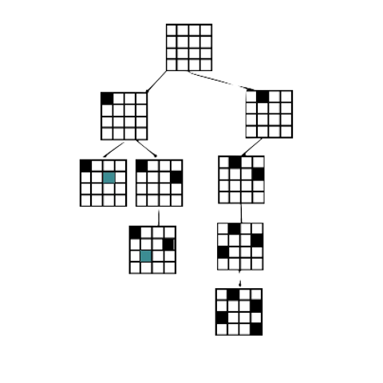
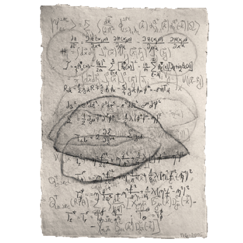

## What's in here?

These are the lecture notes I took, all written in $\LaTeX$ with explicit definition/theorem references hyperlinks, and professional drawings. If you're interested in my setup, take a look [here](../VSCode-LaTeX-Inkscape).
> Due to the privacy policy, for those notes from classes I am/was teaching, the corresponding source codes are not available.

Clicking 📝 directly opens the PDF while clicking $\LaTeX$ will lead you to the $\LaTeX$ source code under the main [GitHub repo](https://github.com/sleepymalc/Notes).

## Junior @University of Michigan

### Fall 2021

#### Linear Programming (MATH561/IOE510/TO518) \[[📝](./LinProg.pdf) | [$\LaTeX$](https://github.com/sleepymalc/Notes/tree/main/MATH561-Linear-Programming)\]

	

This is the first course in the series of graduate-level, large-scale, and rigorous mathematical programming courses taught by [Jon Lee](https://sites.google.com/site/jonleewebpage/). Topics include **Duality Theorems**, the mathematical rigorous **Simplex Algorithm**, **Complementary Slackness**, **Large-Scale Linear Programming**, **Sensitivity Analysis**, and **Integer Programming** with their applications.
> This course is not intended to teach you how to *hand-solve small-scale* linear programming problems, rather, it's intended to give a rigorous foundation for solving *large-scale* linear programming problems in an algorithmic way. We rely on `Python` and `Gurobi` for examples to solve various problems in the assignments.

#### Analysis of Social Networks (EECS544/EECS444) \[[📝](./SocNetAnalysis.pdf) | [$\LaTeX$](https://github.com/sleepymalc/Notes/tree/main/EECS544-Analysis-of-Social-Networks)\]

	

This is a graduate-level course about social network analysis taught by [Vijay G Subramanian](https://subramanian.engin.umich.edu/), aiming at a rigorous mathematical understanding of various social network algorithms and theories. Topics include **Graph Partitioning Algorithms**, **Stochastic Processes**, **Random Graph Theory**, and **Algorithmic Game Theory**, including **Auctions** and **Matching Market Algorithms**.
> The course title makes this course's intended audience rather narrow, but actually one can get a lot out of this course, especially some classical graph algorithms with theoretical analysis.

### Winter 2022

#### Algebraic Topology (MATH592) \[[📝](./AlgTop.pdf) | [$\LaTeX$](https://github.com/sleepymalc/Notes/tree/main/MATH592-Introduction-to-Algebraic-Topology)\]

	

This is a graduate-level course taught by [Jennifer Wilson](http://www.math.lsa.umich.edu/~jchw/) about Introduction to Algebraic Topology. Topics include **CW-Complex**, **Fundamental Group**, **Van-Kampen Theorem**, **Homology**, and also their applications like [Lefschetz fixed-point theorem](https://en.wikipedia.org/wiki/Lefschetz_fixed-point_theorem).
> Some topology and abstract algebra background is required, especially group theory. But other than that, the course is self-contained enough.

#### Real Analysis (MATH597) \[[📝](./ReAnalysis.pdf) | [$\LaTeX$](https://github.com/sleepymalc/Notes/tree/main/MATH597-AnalysisII)\]

	

This is a graduate-level real analysis course taught by [Jinho Baik](http://www.math.lsa.umich.edu/~baik/Welcome.html). Topics include **Measure Theory**, **Hilbert Spaces**, **Banach Spaces**, **$L^p$ Spaces**, and some **Fourier Analyses**. While focusing on real measures, we did discuss signed and complex measures for completeness.
> This course is pretty rigorous and well-structured and acts as a pre-request for [functional analysis (MATH 602)](#functional-analysis-math602). It's self-contained enough and only needs some previous exposure to mathematical analysis.

## Senior @University of Michigan

### Fall 2022[^1]

[^1]: I also took Nonlinear Programming (MATH663/IOE611), but the professor provided excellent lecture slides, so I won't bother scribing it myself.

#### Randomness and Computation ([EECS572](https://mahdi.ch/eecs572/), TA) \[[📝](./RandComp.pdf)\]

	

This is an advanced graduate-level theory course focused on randomized complexity and related topics taught by [Mahdi Cheraghchi](https://mahdi.ch/). Topics include various **randomized algorithms**, **Randomized Complexity**, **Markov Chains**, **Random Walks**, **Expander Graphs**, **Pseudo-random Generators**, and **Hardness v.s. Randomness**.
> Overall a rigorous course covering all background knowledge one might need to do research in the related fields. I'm grateful to be a teaching assistant for this course together with Neophytos Charalambides as an undergrad.

#### Approximation Algorithms and Hardness of Approximation (EECS598-001) \[[📝](./AppxAlgo.pdf) | [$\LaTeX$](https://github.com/sleepymalc/Notes/tree/main/EECS598-001-Approximation-Algorithms-and-Hardness-of-Approximation)\]

	

This is a graduate-level algorithm course taught by [Euiwoong Lee](https://web.eecs.umich.edu/~euiwoong/), which focuses on methods of designing and analyzing approximation algorithms, together with the theoretical background on showing the hardness of approximation. Topics include **Covering**, **Clustering**, **Network Design**, and **CSP**. We also discussed **Lasserre (SoS) Hierarchy**, **Unique Game Conjecture**, and **Probabilistic Checkable Proofs**.
> This is one of the most exciting courses I have taken: algorithmic design, hardness of approximation, and fancy topics such as *SoS hierarchy*, *PCP*, and *UGC* are all fun to learn, especially the approximated complexity theory part.

#### Functional Analysis (MATH602) \[[📝](./ReAnalysis-II.pdf) | [$\LaTeX$](https://github.com/sleepymalc/Notes/tree/main/MATH602-Real-Analysis-II)\]

	

This is a graduate-level functional analysis course taught by [Joseph Conlon](http://www.math.lsa.umich.edu/~conlon/). The focus of this course is rather standard, including **Banach and Hilbert Spaces Theory**, **Bounded Linear, Compact, and Self-Adjoint Operators Theorem**, **Representation, Hahn-Banach, Open Mapping Theorem**, and **Spectral Theory**. We also covered some point-set topology along the way.
> A rigorous course gives you the needed tools for analyzing function spaces. It'll give you a solid understanding of infinite dimensional vector spaces and how to deal with operators over these spaces.

### Winter 2023

#### Introduction to Cryptography ([EECS475](https://mahdi.ch/eecs475/), TA) \[[📝](./Crypto.pdf)\]

	

This is an upper-level theory course on formal cryptography and related topics taught by [Mahdi Cheraghchi](https://mahdi.ch/). Topics include various **Historic Ciphers**, **Perfect Secrecy**, **Symmetric Encryption** (including pseudo-random generators, stream ciphers, pseudo-random functions, and permutations), **Message Authentication**, **Cryptographic Hash Functions**, and **Public Key Encryption**.
> An interesting foray into theoretical cryptography. I'm grateful to be a teaching assistant for this course together with Nikhil Shagrithaya as an undergrad.

#### Mathematical Logic (MATH681) \[[📝](./Logic.pdf) | [$\LaTeX$](https://github.com/sleepymalc/Notes/tree/main/MATH681-Mathematical-Logic)\]

	

This is a graduate-level mathematical logic course taught by [Matthew Harrison-Trainor](http://www-personal.umich.edu/~matthhar/), aiming to obtain insights into all other branches of mathematics, such as algebraic geometry, analysis, etc. Specifically, we will cover **Model Theory** beyond the basic foundational **Ideas of Logic**.
> "Learn some fundamental stuff and show off to your friends" is basically my mindset when taking this course 🤪 But seriously, learning something fundamental at this level is a new experience and challenge for me, but hey, it's the last semester, so might just relax and see how it goes!

#### Riemannian Geometry (MATH635) \[[📝](./RiemGeo.pdf) | [$\LaTeX$](https://github.com/sleepymalc/Notes/tree/main/MATH635-Riemannian-Geometry)\]

	

This is the advanced graduate-level differential geometry course focused on Riemannian geometry taught by [Lydia Bieri](http://www-personal.umich.edu/~lbieri/). Topics include local and global aspects of differential geometry and the relation with the underlying topology.
> I always wanted to have a solid understanding of differential geometry since the recent advances in machine learning theory rely on related concepts quite heavily in some particular branches such as optimization and the well-known [manifold hypothesis](https://en.wikipedia.org/wiki/Manifold_hypothesis), or information geometry.

## First Year Ph.D. @University of Illinois Urbana-Champaign

### Fall 2023

#### Empirical Process Theory (STAT576) \[[📝](./EmpProcess.pdf) | [$\LaTeX$](https://github.com/sleepymalc/Notes/tree/main/STAT576-Empirical-Process-Theory)\]

	

This is the advanced graduate-level statistics course focused on empirical process theory taught by [Sabyasachi Chatterjee](https://sabyasachi.web.illinois.edu/). Topics include the classical **Concentration Inequality**, **Expected Supremum of Empirical Process**, **Applications to M-Estimation**, and **Fixed Design Non-Parametric Regression**.
> This is one of the hardest courses I have taken due to how messy some calculations are and the common tricks used in theoretical statistics which I'm not familiar with. However, this is quite relevant to modern generalization theory for deep learning (actually a foundation), so I enjoy learning this course quite a lot.

### Spring 2024

#### Large Sample Theory (STAT575) \[[📝](./LargeSample.pdf) | [$\LaTeX$](https://github.com/sleepymalc/Notes/tree/main/STAT575-Large-Sample-Theory)\]

	

This is a graduate-level theoretical statistics course taught by [Georgios Fellouris](https://publish.illinois.edu/fellouri/), aiming to provide an introduction to the asymptotic analysis of various statistical methods, including **Weak Convergence**, **Lindeberg-Feller CLT**, **Asymptotic Relative Efficiency**, etc.
> Feel sometimes overwhelmed by all the unfamiliar probabilistic intuitions, but overall this course covers a great deal of topics that I feel important and commonly seen but not well-understood. Overall, quite a joy to learn asymptotic theory rigorously.

## Second Year Ph.D. @University of Illinois Urbana-Champaign

### Fall 2024

#### Topics in Graph Algorithms (CS598) \[[📝](./GraphAlgo.pdf) | [$\LaTeX$](https://github.com/sleepymalc/Notes/tree/main/CS598-Topics-in-Graph-Algorithms)\]

	

This is a graduate-level theory course taught by [Chandra Chekuri](https://chekuri.cs.illinois.edu/), aiming to cover selection of topics in graph algorithms with an emphasis on recent developments on **fast algorithms** for a variety of problems such as *shortest paths*, *flows*, *cuts*, and *matchings*. Structural results and connections to past ideas and results will also be discussed.
> I now feel bad of the past self as I thought I know graph algorithms before taking this class. Such a gem. This class contains a wide range of classical/contemporary and necessary tools you need for conducting graph algorithm research.
