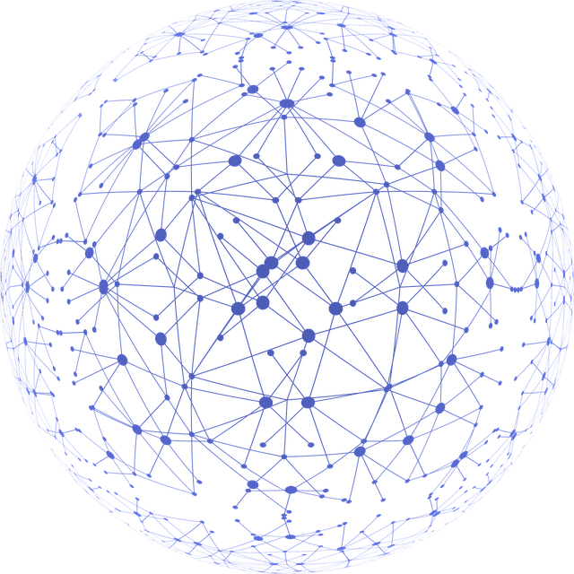
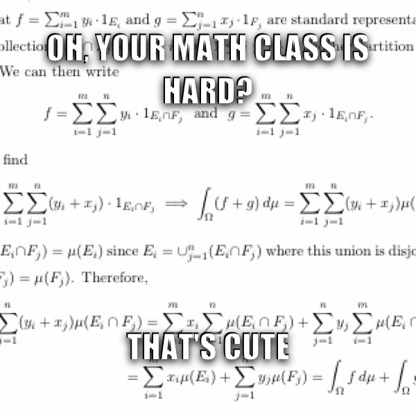

# Introduction
These are a selection of my notes of courses taught at University of Michigan. If you're interested in the $\LaTeX$ code, have a look on [Github](https://github.com/sleepymalc/Notes). 
If you're interested in my setup, also have a look on [Github](https://github.com/sleepymalc/VSCode-LaTeX-Inkscape) or just [here](./VSCode-LaTeX-Inkscape).

## What's in here?
All notes are written in modern style $\LaTeX$ with clear definition/theorem references and hyperlinks. Also, the drawing is done in a professional and clean way.
> The style of my notes is not fully synchronized... I use hyperlinks and references heavily in Winter 2022, but not Fall 2021. It takes a long time to do this, 
I'm trying.

# Junior

## Fall 2021
### Linear Programming (MATH561/IOE510/TO518 @Umich) 

	

> * [pdf](./LinProg.pdf)
> * [$\LaTeX$](https://github.com/sleepymalc/Notes/tree/main/MATH561-Linear_Programming)

This is the first course toward the series of large-scale and rigorous mathematical programming graduated level courses taught by [Jon Lee](https://sites.google.com/site/jonleewebpage/). 
Topics include **Linear Programming**, **Weak and Strong Duality**, **Large-Scale Linear Programming**, **Sensitivity Analysis** and also **Integer Programming** and their applications.

### Analysis of Social Networks (EECS544/EECS444 @Umich)

	

> * [pdf](./SocNetAnalysis.pdf)
> * [$\LaTeX$](https://github.com/sleepymalc/Notes/tree/main/EECS544-Analysis_of_Social_Networks)

This is a course about social network analysis taught by [Vijay G Subramanian](https://subramanian.engin.umich.edu/), covering topics across **Graph Partitioning Algorithm**,
**Random Process**, **Random Graph Theory** and **Game Theory** with **Auctions**.

## Winter 2022
### Algebraic Topology (MATH592 @Umich)

	

> * [pdf](./AlgTop.pdf)
> * [$\LaTeX$](https://github.com/sleepymalc/Notes/tree/main/MATH592-Introduction_to_Algebraic_Topology)

This is an introductory course taught by [Jennifer Wilson](http://www.math.lsa.umich.edu/~jchw/) about Algebraic Topology which is self-contained enough that only 
requires background about abstract algebra and some point set topology. Topics include **CW-Complex**, **Fundamental Group**, **Van-Kampen Theorem**, **Homology** and also their applications 
like [Lefschetz fixed-point theorem](https://en.wikipedia.org/wiki/Lefschetz_fixed-point_theorem).

### Real Analysis (MATH597 @Umich)

	

> * [pdf](./ReAnalysis.pdf)
> * [$\LaTeX$](https://github.com/sleepymalc/Notes/tree/main/MATH597-AnalysisII)

This is the graduate level Real Analysis taught by [Jinho Baik](http://www.math.lsa.umich.edu/~baik/Welcome.html). Everything is built up from Measure Theory,
like integration and differentiation. Topics include **Measure Theory**, **Hilbert/Banach Spaces** and also **$L^p$ Spaces**, **Introduction to Fourier Analysis**.

# Senior

## Fall 2022
> Wait for it... 
