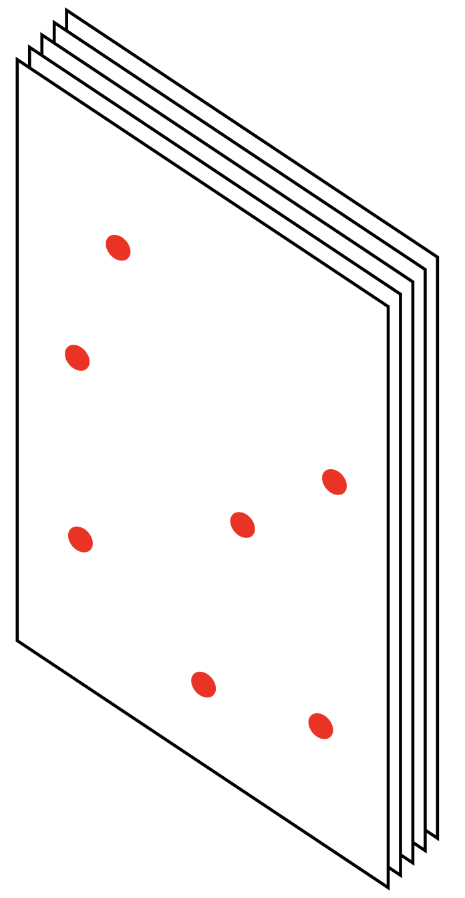
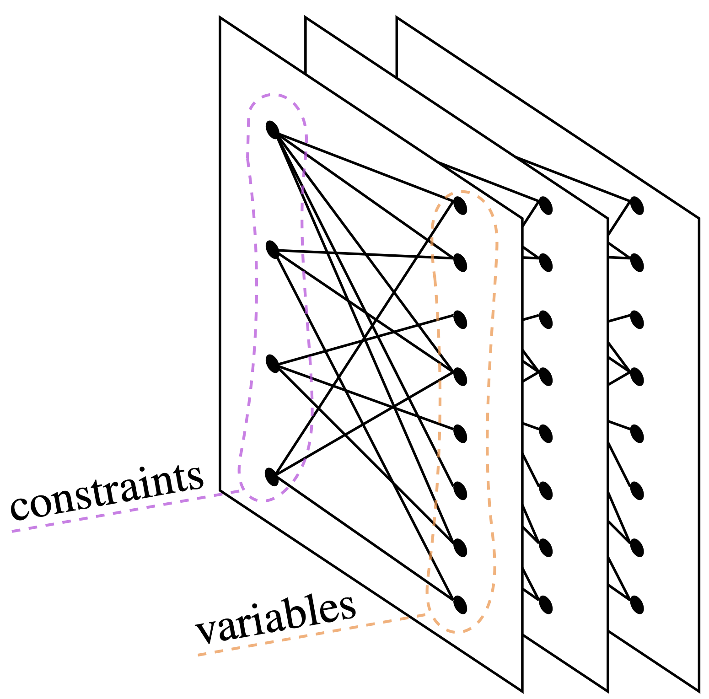

# Introduction
The traveling salesman problem (TSP) can be described as follows: given a list of cities and the distances between each pair of cities, find the
shortest route possible that visits each city *exactly once* then returns to the origin city.
Specifically, given an **undirected weighted graph** $\mathcal{G} = (\mathcal{E}, \mathcal{V})$, with an ordered pair of nodes set $\mathcal{E}$
and an edge set $\mathcal{V}\subseteq \mathcal{E}\times\mathcal{E}$ where $\mathcal{G}$ is equipped with **spatial structure**. This means that
each edge between nodes will have different weights and each node will have its coordinates, we want to find a simple cycle that visits every node exactly
once while having the smallest cost.

We will utilize GCNN (Graph Convolutional Neural Network), a particular kind of GNN, together with imitation learning to solve TSP in an interesting
and inspiring way. In particular, we focus on the generalization ability of models trained on small-sized problem instances. 

# Preliminary
We direct reader who is interested in technical detailed to the [paper](./paper.pdf) for the preliminary and technical part of this project. The following 
is just a very brief summary.
## Integer Linear Programming Formulation of TSP
We first formulate TSP in terms of **Integer Linear Programming**. Given an undirected weighted group $\mathcal{G} = (\mathcal{E}, \mathcal{V})$,
we label the nodes with numbers $1, \ldots, n$ and define
$$
	x_{ij}\coloneqq \begin{dcases}
		1, & \text{if }(i, j)\in \mathcal{E}^\prime                       \\
		0, & \text{if } (i, j)\in \mathcal{E}\setminus\mathcal{E}^\prime,
	\end{dcases}
$$
where $\mathcal{E}^\prime\subset \mathcal{E}$ is a variable which can be viewed as a compact representation of all variables $x_{ij}$, $\forall i, j$.
Furthermore, we denote the weight on edge $(i, j)$ by $c_{ij}$, then for a particular TSP problem instance, we can formulate the problem as follows.
$$
	\begin{aligned}
		\min & \sum _{i=1}^{n}\sum _{j\neq i,j=1}^{n}c_{ij}x_{ij} &  &                      \\
		     & \sum _{i=1,i\neq j}^{n}x_{ij}=1                    &  & j=1,\ldots ,n;       \\
		     & \sum _{j=1,j\neq i}^{n}x_{ij}=1                    &  & i=1,\ldots ,n;       \\
		     & u_{i}-u_{j}+nx_{ij}\leq n-1                        &  & 2\leq i\neq j\leq n; \\
		     & 1\leq u_{i}\leq n-1                                &  & 2\leq i\leq n;       \\
		     & x_{ij}\in \{0,1\}                                  &  & i,j=1,\ldots ,n;     \\
		     & u_{i}\in \mathbb{Z}                                &  & i=2,\ldots ,n.
	\end{aligned}
$$

This is the Miller-Tucker-Zemlin formulation\cite{MTZ-formulation}. Note that in our case, since we are solving TSP exactly, all variables are
integers. This type of integer linear programming is sometimes known as **pure integer programming**.

## Branch and Bound
We then solve TSP as the above ILP formulation by **branch and bound**. It's possible to do branch and bound sufficiently by choosing a good branch strategy, 
and since branching and bound involves *performing a series of branching strategy*, so we model this as **Markov Decision Process (MDP)** in its nature.

Now, our goal is clear: We want to learn from an expert (in this case, a SOTA modern solver $\texttt{SCIP}$), which is typically called **imitating learning**.

# Pipeline
Our learning pipeline is as follows. We first create some random TSP instances and turn them into ILP,
then we use imitation learning to learn how to choose the **branching target** at each branching.
Our GNN model produces a set of actions with the probability corresponding to each possible action (in our case, which variable to branch). We then
use **Cross-Entropy Loss** to compare our prediction to the result produced by $\texttt{SCIP}$ and complete one iteration.

	

## Graph Convolutional Neural Network (GCNN)
One may wonder where does the GNN involve in our methodology, is it used to model the topology of the nodes of a particular TSP instances?

	

The answer is **no**. The GCNN is our model which learn how to perform branching given the state of the problem (e.g., given the current state of the explored 
recursion tree of the branch and bound algorithm).

	

## Result

## Discussion

