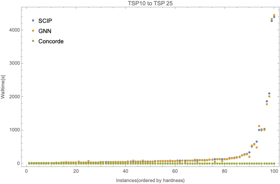
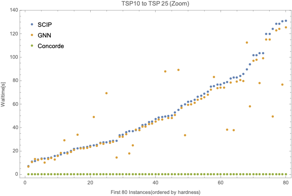
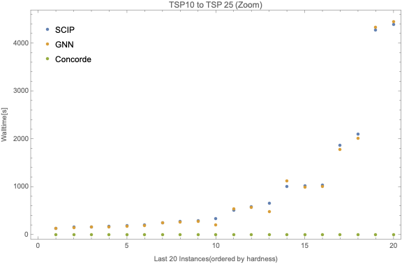

# Introduction
The traveling salesman problem (TSP) can be described as follows: given a list of cities and the distances between each pair of cities, find the
shortest route possible that visits each city *exactly once* then returns to the origin city.
Specifically, given an **undirected weighted graph** $\mathcal{G} = (\mathcal{E}, \mathcal{V})$, with an ordered pair of nodes set $\mathcal{E}$
and an edge set $\mathcal{V}\subseteq \mathcal{E}\times\mathcal{E}$ where $\mathcal{G}$ is equipped with **spatial structure**. This means that
each edge between nodes will have different weights and each node will have its coordinates, we want to find a simple cycle that visits every node exactly
once while having the smallest cost.

We will utilize GCNN (Graph Convolutional Neural Network), a particular kind of GNN, together with imitation learning to solve TSP in an interesting
and inspiring way. In particular, we focus on the generalization ability of models trained on small-sized problem instances. 

# Preliminary
We direct reader who is interested in technical detailed to the [paper](./paper.pdf) for the preliminary and technical part of this project. The following 
is just a very brief summary.
## Integer Linear Programming Formulation of TSP
We first formulate TSP in terms of **Integer Linear Programming**. Given an undirected weighted group $\mathcal{G} = (\mathcal{E}, \mathcal{V})$,
we label the nodes with numbers $1, \ldots, n$ and define
$$
	x_{ij}\coloneqq \begin{dcases}
		1, & \text{if }(i, j)\in \mathcal{E}^\prime                       \\
		0, & \text{if } (i, j)\in \mathcal{E}\setminus\mathcal{E}^\prime,
	\end{dcases}
$$
where $\mathcal{E}^\prime\subset \mathcal{E}$ is a variable which can be viewed as a compact representation of all variables $x_{ij}$, $\forall i, j$.
Furthermore, we denote the weight on edge $(i, j)$ by $c_{ij}$, then for a particular TSP problem instance, we can formulate the problem as follows.
$$
	\begin{aligned}
		\min & \sum _{i=1}^{n}\sum _{j\neq i,j=1}^{n}c_{ij}x_{ij} &  &                      \\
		     & \sum _{i=1,i\neq j}^{n}x_{ij}=1                    &  & j=1,\ldots ,n;       \\
		     & \sum _{j=1,j\neq i}^{n}x_{ij}=1                    &  & i=1,\ldots ,n;       \\
		     & u_{i}-u_{j}+nx_{ij}\leq n-1                        &  & 2\leq i\neq j\leq n; \\
		     & 1\leq u_{i}\leq n-1                                &  & 2\leq i\leq n;       \\
		     & x_{ij}\in \{0,1\}                                  &  & i,j=1,\ldots ,n;     \\
		     & u_{i}\in \mathbb{Z}                                &  & i=2,\ldots ,n.
	\end{aligned}
$$

This is the Miller-Tucker-Zemlin formulation\cite{MTZ-formulation}. Note that in our case, since we are solving TSP exactly, all variables are
integers. This type of integer linear programming is sometimes known as **pure integer programming**.

## Branch and Bound
We then solve TSP as the above ILP formulation by **branch and bound**. It's possible to do branch and bound sufficiently by choosing a good branch strategy, 
and since branching and bound involves *performing a series of branching strategy*, so we model this as **Markov Decision Process (MDP)** in its nature.

Now, our goal is clear: We want to learn from an expert (in this case, a SOTA modern solver $\texttt{SCIP}$), which is typically called **imitating learning**.

# Pipeline
Our learning pipeline is as follows. We first create some random TSP instances and turn them into ILP,
then we use imitation learning to learn how to choose the **branching target** at each branching.
Our GNN model produces a set of actions with the probability corresponding to each possible action (in our case, which variable to branch). We then
use **Cross-Entropy Loss** to compare our prediction to the result produced by $\texttt{SCIP}$ and complete one iteration.

	

## Graph Convolutional Neural Network (GCNN)
One may wonder where does the GNN involve in our methodology, is it used to model the topology of the nodes of a particular TSP instances?

The answer is **no**. The GCNN is our model which learn how to perform branching given the state of the problem (e.g., given the current state of the explored 
recursion tree of the branch and bound algorithm). Intuitively, in the pipeline graph above, 
* Top-left corresponds to TSP instances (red dots corresponding to actual cities in TSP problem).
* Bottom-left corresponds to our model (black dots corresponding to a node in our GCNN).

Now, it should clear that how we utilize GNN to help us to solve this TSP problem: We use GCNN to learn a 
strong branching strategy and use it to do branching whenever needed.

# Experimental Result
We look at the walltime needed for the model trained on TSP10 and tested on TSP25 for 100 instances (ordered by the walltime of $\texttt{SCIP}$).

	

If we zoom-in to the first 80 and last 20 instances, we have the following.

	

	

We see that we perform basically the same compare to $\texttt{SCIP}$, which indicates that our model is able to generalize quite well.

# Discussion
Here we list some selected discussion. Again, please refer to the [paper](./paper.pdf) for completeness.

## Generalization Ability
We observe that our TSP10 and TSP15 imitation models outperform the $\texttt{SCIP}$ solver on baseline test instances, and
**successfully generalizes to TSP15, TSP20, and TSP25**. They perform significantly better on average than $$\texttt{SCIP}$$ in difficult-to-solve TSPs as
compared to easier instances. They also perform better in cases of larger test instances like TSP20 and TSP25 as compared to TSP10 and TSP15.
This might be due to an inherent subset structure between TSP10 and TSP20 instances, and similarly TSP15 and TSP25 instances which might not be the
case for smaller test sizes. Unlike other problems, when we formulate TSP as an ILP, the problem size is growing **quadratically**.
In other words, when we look at the model performance, the generalization ability from TSP10 to TSP25 is not a $2.5\times$, but rather a $6\times$
generalization in our formulation. By adapting this methodology on a more sophisticated algorithm which formulates TSP linearly, the generalization
ability should remain, and the performance will be even better in terms of TSP sizes.

## Bottlenecks and Future Work
There is a huge performance difference between our proposed model (also $\texttt{SCIP}$) and the SOTA TSP solver, $\texttt{Concorde}$. Since the proposed
model's backbone is branch and bound algorithm, by formulating TSP into an ILP, we lost some useful problem structures which can be further exploited by
algorithms used in $\texttt{Concorde}$. But the existence of a similar pattern of growth in solving time for more difficult instances of larger TSP sizes
even for $\texttt{Gurobi}$ and $\texttt{Concorde}$ is promising, as our imitation model applied to these solvers should
lead to similar time improvements. A major bottleneck is that SOTA solvers like $\texttt{Gurobi}$, or $\texttt{Concorde}$, are often licensed, hence not
open-sourced. This results in the difficulty of utilizing a stronger baseline and learn from which to get a further improvement.

# Conclusion
Finding exact solutions of combinatorial optimization problems as fast as possible is a challenging avenue in modern theoretical CS. Our proposed method
is a step toward this goal via machine learning. For nearly all exact optimization solving algorithms, there is some kind of *exhaustion* going on
which usually involves decisions-making when executing the algorithm. For example, the cutting plane algorithm also
involves decisions-making on variables when it needs to choose a variable to cut. We see that by using our model to replace several such algorithms,
we can speed up the inference time while still retaining a high-quality decision strategy. Furthermore, our experimental results show that the model can
effectively learn such strategies while using less time when inference, which is a promising strategy when applied to other such algorithms.